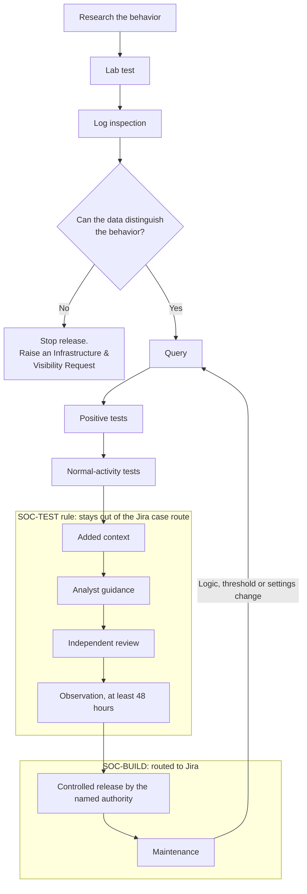

# Pacific Watch Detection Engineering

**The operating standard every Pacific Watch detection follows, from research to release to maintenance.**

## What this is

This is the Detection Build Card (v3.0) that I wrote for Pacific Watch, an advisory-only SOC on a training cyber range, plus working templates and a worked example. The card is an operating template, not evidence that any detection has passed testing. The worked example grades my own first production rule against it.

## Worked example

[PASSWORDSPRAY-ALWAYSONLINUX-T1110.003](examples/PASSWORDSPRAY-ALWAYSONLINUX-T1110.003/) was the first production Pacific Watch detection, built in July 2026 under v2 of the card. It is presented as a **historical detection review with incomplete evidence**: the baseline dates and test evidence are missing (the deployed query was recovered during the review), and the [v3 conformance review](examples/PASSWORDSPRAY-ALWAYSONLINUX-T1110.003/v3-conformance-review.md) says so rather than filling the gaps. The review grades 65 requirements (18 met, 26 partially met, 2 not met, 19 not recorded) and found defects in my own playbook and query. The historical version stays as it was; a [corrected draft](examples/PASSWORDSPRAY-ALWAYSONLINUX-T1110.003/PB-PASSWORDSPRAY-ALWAYSONLINUX-T1110.003-v2.md) and a [record of what changed and why](examples/PASSWORDSPRAY-ALWAYSONLINUX-T1110.003/README.md#what-changed-from-v1-to-v2) sit beside it. The retest is still to come.

## The lifecycle

## Why it exists

Early unthresholded test rules generated roughly 286 to 293 alerts per day from Jul 12 to 15, 2026, and 316 Jira cases, which buried real signal. The card adds controls intended to prevent a repeat:

- **A threshold measured from a baseline**, placed inside the query. No threshold is approved from intuition alone.
- **One result row per subject that needs review.** Separately, all rows from one run are grouped into a single alert. These are different layers, so the card requires checking that the alert, entities and ticket preserve every affected subject.
- **A routing boundary**: test rules are named SOC-TEST and stay out of the Jira case-creation route. Only the named release authority changes them to SOC-BUILD.
- **A queue-capacity check**: 3 to 5 alerts per rule per day, retune above 10.

The full story is [case study 01 in cyber-range-soc](https://github.com/jennafrank/cyber-range-soc/blob/main/docs/case-studies/01-queue-flood-316-cases.md). Every local rule in the card and where it came from is in [docs/why-each-rule-exists.md](docs/why-each-rule-exists.md).

## How to read it

- [The card, in Markdown](card/detection-build-card.md): all nine sections, readable on GitHub.
- [The card, as designed (PDF)](card/detection-build-card.pdf)
- [Templates](templates/): register entry, evidence record, rule settings checklist, analyst playbook, completion record.
- [Worked example](examples/PASSWORDSPRAY-ALWAYSONLINUX-T1110.003/): the first production detection, reviewed against the card, with its defects and a corrected draft.

## Principles

From the card:

- Build from the records that actually arrive.
- Name the legitimate look-alike.
- No threshold is approved from intuition alone.
- A quiet rule can be healthy or blind; establish which with evidence.
- A documented visibility gap is also a valid outcome.
- Do not write a playbook step that grants authority the analyst does not hold.

## References

As listed in the card:

- [Huntress: The OID Problem, detection development method](https://www.huntress.com/blog/ldap-active-directory-detection-part-one)
- [MITRE ATT&CK: verify technique IDs and mechanisms](https://attack.mitre.org/)
- [Microsoft: Kusto string operators](https://learn.microsoft.com/en-us/kusto/query/datatypes-string-operators)
- [Microsoft: Scheduled analytics rules](https://learn.microsoft.com/en-us/azure/sentinel/scheduled-rules-overview)

---

**Jenna Frank**, Security Operations Manager · [jennafrank.co](https://jennafrank.co) · [LinkedIn](https://linkedin.com/in/jenna-frank-cyber) · [GitHub](https://github.com/jennafrank)

Part of the Pacific Watch SOC. See [cyber-range-soc](https://github.com/jennafrank/cyber-range-soc).
